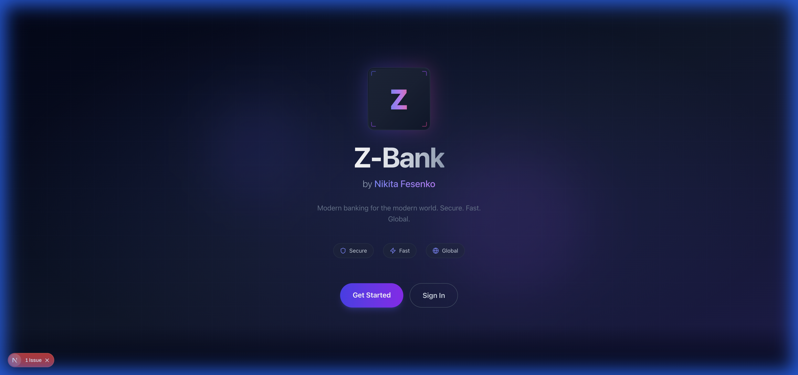

<div align="center">

# 🏦 Z-Bank

### Modern Digital Banking Platform

**Built by Nikita Fesenko**

[](https://openjdk.org/)
[](https://spring.io/projects/spring-boot)
[](https://nextjs.org/)
[](https://www.typescriptlang.org/)
[](https://tailwindcss.com/)

<br/>


</div>

---

## ✨ Features

### 🔐 Authentication & Security
- JWT-based authentication with refresh tokens
- Role-based access control (Client, Admin, Auditor)
- BCrypt password encryption
- CORS protection

### 💳 Account Management
- Multiple EUR accounts per customer
- Real-time balance tracking
- Account status management (Active, Blocked, Closed)
- IBAN generation

### 💸 Transfers
- Internal bank transfers
- Idempotent transfer processing
- Transfer history with pagination
- Real-time status updates

### 📊 Statements & Ledger
- Double-entry bookkeeping
- Transaction history with filters
- Account statements with date ranges
- Credit/Debit tracking

### 👤 User Dashboard
- Account overview with total balance
- Quick transfer actions
- Transaction history
- Profile management

---

## 🛠️ Tech Stack

### Backend
| Technology | Purpose |
|------------|---------|
| **Java 21** | Core language |
| **Spring Boot 3.4** | Application framework |
| **Spring Security** | Authentication & authorization |
| **Spring Data JPA** | Data persistence |
| **Flyway** | Database migrations |
| **H2 / PostgreSQL** | Database (dev/prod) |
| **JWT (jjwt)** | Token-based auth |
| **Swagger/OpenAPI** | API documentation |

### Frontend
| Technology | Purpose |
|------------|---------|
| **Next.js 14** | React framework (App Router) |
| **TypeScript** | Type safety |
| **Tailwind CSS** | Styling |
| **Framer Motion** | Animations |
| **Lucide Icons** | Icon library |

---

## 🚀 Quick Start

### Prerequisites
- Java 21+
- Node.js 18+
- npm or yarn

### 1. Clone the repository
```bash
git clone https://github.com/nickaq/the-bank.git
cd the-bank
```

### 2. Start the Backend
```bash
cd backend
./gradlew bootRun
```
The API will be available at `http://localhost:8080`

### 3. Start the Frontend
```bash
cd frontend
npm install
npm run dev
```
The app will be available at `http://localhost:3000`

---

## 📚 API Documentation

Once the backend is running, access Swagger UI at:
- **Swagger UI**: http://localhost:8080/swagger-ui.html
- **OpenAPI JSON**: http://localhost:8080/api-docs

### API Endpoints

#### Authentication
| Method | Endpoint | Description |
|--------|----------|-------------|
| POST | `/api/v1/auth/register` | Register new user |
| POST | `/api/v1/auth/login` | Login & get tokens |
| POST | `/api/v1/auth/refresh` | Refresh access token |

#### Accounts
| Method | Endpoint | Description |
|--------|----------|-------------|
| GET | `/api/v1/accounts` | Get user's accounts |
| GET | `/api/v1/accounts/{id}` | Get account details |
| GET | `/api/v1/accounts/{id}/balance` | Get account balance |
| GET | `/api/v1/accounts/{id}/statement` | Get account statement |

#### Transfers
| Method | Endpoint | Description |
|--------|----------|-------------|
| GET | `/api/v1/transfers` | Get user's transfers |
| POST | `/api/v1/transfers` | Create new transfer |
| GET | `/api/v1/transfers/{id}` | Get transfer details |

#### Admin (requires ADMIN role)
| Method | Endpoint | Description |
|--------|----------|-------------|
| POST | `/api/v1/admin/customers` | Create customer |
| POST | `/api/v1/admin/accounts` | Create account |
| POST | `/api/v1/admin/accounts/{id}/fund` | Fund account |

---

## 📁 Project Structure

```
the-bank/
├── backend/                    # Spring Boot API
│   ├── src/main/java/com/thebank/
│   │   ├── identity/          # Auth & users
│   │   ├── customers/         # Customer management
│   │   ├── accounts/          # Account management
│   │   ├── transfers/         # Transfer processing
│   │   ├── ledger/            # Double-entry ledger
│   │   ├── audit/             # Audit logging
│   │   └── common/            # Shared utilities
│   └── src/main/resources/
│       └── db/migration/      # Flyway migrations
│
├── frontend/                   # Next.js App
│   ├── src/app/
│   │   ├── (auth)/            # Login & Register
│   │   └── dashboard/         # User dashboard
│   ├── src/components/        # React components
│   ├── src/contexts/          # Auth context
│   ├── src/lib/               # API client
│   └── src/types/             # TypeScript types
│
└── docs/                       # Documentation
    └── assets/                 # Images & media
```

---

## 🧪 Testing

### Backend Tests
```bash
cd backend
./gradlew test
```

### Frontend Build
```bash
cd frontend
npm run build
```

---

## 🔧 Configuration

### Backend (`application.yml`)
```yaml
# Default port
server.port: 8080

# Database (H2 for development)
spring.datasource.url: jdbc:h2:mem:thebank

# JWT secret (change in production!)
jwt.secret: your-secret-key
jwt.expiration: 86400000
```

### Frontend (`.env.local`)
```env
NEXT_PUBLIC_API_URL=http://localhost:8080
```

---

## 📸 Screenshots

<div align="center">

### Landing Page


</div>

---

## 🤝 Contributing

1. Fork the repository
2. Create your feature branch (`git checkout -b feature/amazing-feature`)
3. Commit your changes (`git commit -m 'Add amazing feature'`)
4. Push to the branch (`git push origin feature/amazing-feature`)
5. Open a Pull Request

---

## 📄 License

This project is licensed under the MIT License.

---

<div align="center">

**Made with ❤️ by Nikita Fesenko**

[⬆ Back to top](#-z-bank)

</div>
